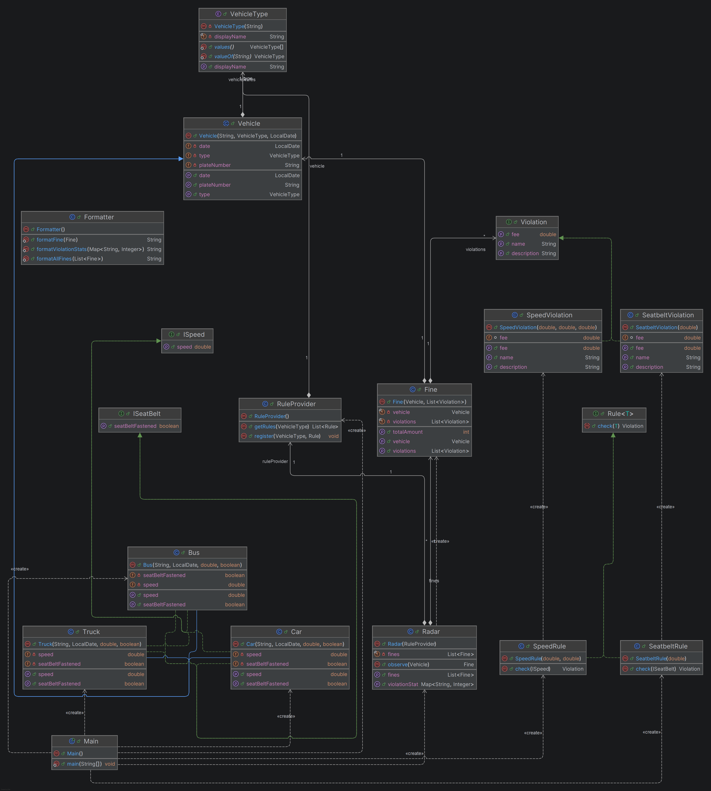

## Project Structure

```text
src
│
├── Main.java
├── Radar.java
├── Formatter.java
│
├── Rules
│   ├── Rule.java
│   ├── RuleProvider.java
│   ├── SpeedRule.java
│   └── SeatbeltRule.java
│
├── Vehicles
│   ├── Vehicle.java
│   ├── Car.java
│   ├── Bus.java
│   ├── Truck.java
│   ├── VehicleType.java
│   ├── ISpeed.java
│   └── ISeatBelt.java
│
└── Violations
    ├── Fine.java
    ├── Violation.java
    ├── SpeedViolation.java
    └── SeatbeltViolation.java
```

The project is organized into three main packages:

- **Vehicles** – Contains the vehicle hierarchy, interfaces, and vehicle types.
- **Rules** – Contains the traffic rule abstraction and concrete rule implementations.
- **Violations** – Contains violation models and fine-related classes.

## UML Class Diagram

<p align="center">
    
</p>